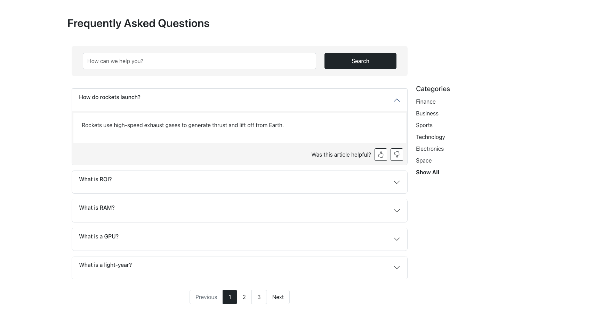

# TYPO3 FAQ Extension - ck_faq

Classification: ck_faq

Version: 1.0.0

Language: en, de

Description: This extension provides a flexible and powerful FAQ solution for TYPO3 CMS, featuring categorized listings, search functionality, pagination, and a user rating system.

Keywords: FAQ, TYPO3, Accordion, Rating, Search, Responsive, Bootstrap, Extbase, Fluid

Copyright: 2025

Author: [Kallol Chakraborty](https://my.typo3.org/u/creativekallol)

License: This document is published under the Open Content License available from https://www.opencontent.org/opl.shtml

The content of this document is related to TYPO3, a GNU/GPL CMS/Framework available from www.typo3.org.

---
## ⚙️ Features

* Categorized FAQ display with smart filtering
* Smart search (by title or description)
* Pagination support
* For anonymous users - Frontend rating using thumbs up/down with cookie protection (one-time vote per FAQ)
* For logged-in frontend users - Feature is upcoming!
* Localized output support (based on configured site language)
* Responsive UI using Bootstrap 5
* FAQ rich text support using RTE
* Fully Extbase & Fluid-based architecture
* Future-ready and compliant with TYPO3 v13

## 📦 Installation

Install the extension via Composer:

```bash
composer req creativekallol/ck-faq
```

## 📌 Plugin Configuration

After installation, follow these steps:

1.	Add the content element FAQ to a TYPO3 page.
2.	Create and assign FAQ categories using TYPO3’s native category system.
3.	Add FAQ records to a dedicated sys folder.
4.	Optionally, customize templates and styles via your sitepackage extension.
5.	Adjust TypoScript settings manually or through the Constant Editor.

### Available Configuration Options:

- **Storage PID**: Limit FAQ records to a specific page/folder. If left empty, records will be fetched from all pages.
- **Category Parent**: Filter categories by a parent category. If not set, all categories will be listed.
- **Items Per Page**: Control pagination size. If not specified, a default value of `5` will be used.

Once configuration is done, don’t forget to **clear the TYPO3 cache**.

---

## 💡 Frontend Output

The extension renders:

- A sidebar of categories with active selection
- A search box (GET method) with a clear button
- An accordion list of FAQs with collapsible answers
- A rating bar (thumbs up/down)
- Pagination below FAQ listing
- Dynamic UI messages based on rating
- FAQs are **sorted by most helpful votes first**, then by **least not-helpful votes**, and finally by newest updates

---

### 📸 Screenshot



---

## 🧪 Backend Enhancements

- Clean backend with helpful label formatting [e.g., `FAQ Title (👍 3, 👎 0)`]
- Category selection is managed using TYPO3’s native `sys_category` with tree view

---

### 🌐 SEO-Friendly Routing Advice

For optimal URL structure, you are encouraged to write your own custom site configuration using YAML. Alternatively, you may refer to the following example:

```yaml
routeEnhancers:
  Category:
    type: Extbase
    extension: CkFaq
    plugin: Pi1
    routes:
      -
        routePath: '/{slug}'
        _controller: 'Faq::list'
        _arguments:
          slug: category
      -
        routePath: '/{slug}/page-{currentPage}'
        _controller: 'Faq::list'
        _arguments:
          slug: category
          currentPage: currentPage
      -
        routePath: '/page-{currentPage}'
        _controller: 'Faq::list'
        _arguments:
          currentPage: currentPage
    defaultController: 'Faq::list'
    aspects:
      slug:
        type: PersistedAliasMapper
        tableName: sys_category
        routeFieldName: slug
      currentPage:
        type: StaticRangeMapper
        start: '1'
        end: '100'
    requirements:
      product-slug: '^[a-z0-9\-]+$'
    limitToPages:
      - 2  # Replace with your actual FAQ plugin page ID
```

---

### 📝 TODO

1. Turn ON/OFF the entire Rating feature, so that FAQ can be used with or without rating system
2. Configure use of Bootstrap 5 CDN only if it is not available in sitepackage
3. Enable rating system based on logged-in frontend users.
4. Make the plugin configurable to allow update of rating data in real time or via batch processing (important for high-traffic websites).

---

## 🧰 Technologies Used

- TYPO3 CMS 13.x
- Extbase & Fluid
- Bootstrap 5 (via CDN)

---

### ❤️ Support the Extension

This extension thrives with **active sponsorship** to stay updated in the TYPO3 ecosystem and remain compatible with future TYPO3 versions.

You can become a **title sponsor** of this extension.

📬 Reach out to me at [kallolchakraborty@hotmail.com](mailto:kallolchakraborty@hotmail.com)

---

### 🌟 Suggest a new feature?

If you want to suggest a feature or request something custom, feel free to email me at [kallolchakraborty@hotmail.com](mailto:kallolchakraborty@hotmail.com).

---

### 🐞 Found a bug?

* First, check out the `main` branch and verify that the issue hasn’t already been resolved.
* Review the existing [issues](https://github.com/creativekallol/ck_faq/issues) to avoid duplicates.
* If not found, report the bug in the [issue tracker](https://github.com/creativekallol/ck_faq/issues/new).

---

### 🤝 Want to contribute?

We welcome contributions via pull requests.
Please ensure your commit messages follow a conventional format (e.g., `[BUGFIX]`, `[FEATURE]`) and include clear details.

Good Luck!

---
